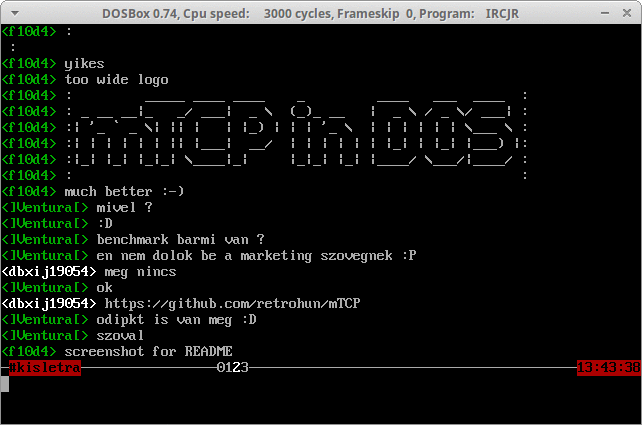
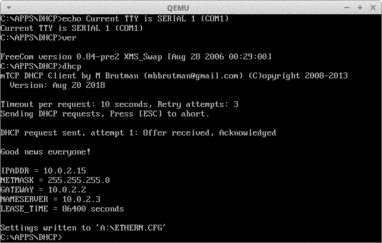

# mTCP Source Code Readme
2020-01-08 Version

- Original project's home page: http://www.brutman.com/mTCP
- Original author's home page: http://www.brutman.com/

## Naszvadi, Peter's modifications:

- Can be built all with Openwatcom C 1.9 under dos using BUILDDOS.BAT
  - Added CLEANDOS.BAT for cleaning purposes
  - Building is tested in DOSBox (https://www.dosbox.com/wiki)

### TODO

- Backporting my optional build settings using only DOS STDIO calls instead of BIOS

### IRCJR.EXE IRC client session in dosbox:

### Invocation of DHCP.EXE from serial console:

See [00README.TXT](00README.TXT) for more details!
